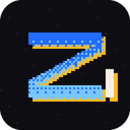

<div align="center">



# Zimacs

A text editor written in Zig, drawn with raylib.

</div>

---

Zimacs is a small, fast, self-contained text editor. The font is baked into the
binary, the settings are one plain text file, and the whole thing draws its own
interface. No GTK, no Electron, no toolkit to install.

## Features

- **Piece-tree text storage**, the same design VS Code uses, so edits stay
  fast in large files
- **Tabs**, with close buttons and an unsaved marker
- **Undo and redo**, coalescing runs of typing so one undo removes a word
- **Selection** by keyboard, mouse drag, double-click for a word, triple-click
  for a line
- **Find** with wrap-around (`Ctrl+F`, `F3`)
- **File browser** drawn in the editor, so it looks and works the same on every
  platform
- **Session restore**: reopens exactly as you left it, Notepad++ style: tabs
  with unsaved work, cursors, selections, scroll, zoom and window placement.
  Saved every few seconds too, so a crash or shutdown loses almost nothing
- **Line wrapping**, optional
- **UTF-8** throughout, including monochrome emoji
- **Configurable** colours, font size, caret style, tab width

## Installing

### Linux

```sh
curl -fsSL https://raw.githubusercontent.com/IWhitebird/Zimacs/master/scripts/install.sh | sh
```

Installs to `~/.local`, puts `zimacs` on your PATH and registers a desktop
entry, so Zimacs shows up in your applications menu. No root needed. Set
`PREFIX` to install somewhere else.

### Windows

```powershell
irm https://raw.githubusercontent.com/IWhitebird/Zimacs/master/scripts/install.ps1 | iex
```

Installs to `%LOCALAPPDATA%\Programs\Zimacs`, adds it to your PATH and creates
a Start Menu shortcut.

Both scripts check the download against the checksum published beside it. That
catches a corrupted download; it is not a signature and does not prove who
built the binary. If you would rather do it yourself, the
[releases page](https://github.com/IWhitebird/Zimacs/releases/latest) has the
archives.

### Uninstalling

```sh
rm -rf ~/.local/share/zimacs ~/.local/bin/zimacs \
  ~/.local/share/applications/zimacs.desktop \
  ~/.local/share/icons/hicolor/256x256/apps/zimacs.png
```

## Building

Needs [Zig 0.16.0](https://ziglang.org/download/) and nothing else. raylib is
fetched and built by the build script.

```sh
zig build            # build
zig build run        # build and run
zig build run -- notes.txt
zig build test       # run the tests
```

### Other platforms

```sh
zig build -Dtarget=x86_64-windows            # Windows .exe
zig build -Dtarget=aarch64-macos             # macOS (needs the Apple SDK)
zig build -Dtarget=wasm32-emscripten run     # web: build, serve, open
```

The web build lands in `zig-out/web`. It has to be served over HTTP, because a
browser will not load wasm from a `file://` URL, so `run` starts a server for
you. Any static server works:

```sh
python3 -m http.server 8000 --directory zig-out/web
```

There is no filesystem in the browser, so opening and saving files are
unavailable there; everything else works.

## Keys

**Editing**

| | |
|---|---|
| `Ctrl+Z` / `Ctrl+Y` | undo / redo |
| `Ctrl+X` `Ctrl+C` `Ctrl+V` | cut, copy, paste |
| `Ctrl+Backspace` / `Ctrl+Delete` | delete a word |
| `Tab` / `Shift+Tab` | indent / outdent (the whole selection) |
| `Ctrl+D` / `Ctrl+Shift+K` | duplicate / delete line |
| `Alt+Up` / `Alt+Down` | move the line |
| `Ctrl+Enter` / `Ctrl+Shift+Enter` | open a line below / above |

**Moving and selecting**

| | |
|---|---|
| `Shift` + any movement | extend the selection |
| `Ctrl+Left` / `Ctrl+Right` | move by word |
| `Home` | first non-blank, then column 0 |
| `Ctrl+Home` / `Ctrl+End` | start / end of file |
| `Ctrl+A` / `Ctrl+L` | select all / select line |
| `Ctrl+G` | go to line |
| double / triple click | select word / line |
| click the gutter | select that line |

**Finding**

| | |
|---|---|
| `Ctrl+F` | find |
| `F3` / `Shift+F3` | next / previous match |

**Files and tabs**

| | |
|---|---|
| `Ctrl+N` / `Ctrl+W` | new tab / close tab |
| `Ctrl+O` / `Ctrl+R` | open (file browser) / recent files |
| `Ctrl+S` / `Ctrl+Shift+S` | save / save as |
| `Ctrl+Tab` / `Ctrl+Shift+Tab` | next / previous tab |
| `Ctrl+1` … `Ctrl+9` | jump to a tab (`Ctrl+9` = last) |
| `Ctrl+,` | edit settings |

**View**

| | |
|---|---|
| `Ctrl` `+` `-` `0` | zoom in, out, reset |
| wheel / `Shift`+wheel | scroll / scroll sideways |

## Updates

Zimacs keeps itself up to date. On startup it asks GitHub for the latest
release, and if there is a newer one it downloads it in the background, checks
it, and puts it in place of the running copy. The new version runs the next
time you start Zimacs; the status bar says so when it is ready. Nothing is
said at all when you are already current.

An update is only installed if it is signed by the Zimacs release key, which
lives in the release workflow and nowhere in this repository. The matching
public key is built into every copy, so a download that has been tampered
with, or a release asset that has been swapped, is refused rather than run. A
checksum could not give that guarantee: anyone who can change a file can
change the checksum published beside it, but not a signature. What is signed
is the binary together with the version and platform it is for, so an old
build cannot be passed off as a new one.

Only the official release builds update themselves. A copy you build yourself
never replaces itself with whatever was last published, and
`Help → Check for Updates` in one only tells you whether a newer release
exists. To switch updates off, set `auto_update = false`.

## Settings

Written on first run, and openable from `Help → Edit Settings` or `Ctrl+,`:

| Platform | Location |
|---|---|
| Linux | `~/.config/zimacs/config.ini` |
| macOS | `~/Library/Application Support/zimacs/config.ini` |
| Windows | `%APPDATA%\zimacs\config.ini` |

```ini
font_size = 18
caret_style = line      # line, block or underline
tab_width = 4
expand_tabs = true
wrap_lines = false
show_hidden = false
restore_session = true
custom_titlebar = true  # false for your system's own window frame
auto_update = true      # install signed releases in the background

background = #181818
text = #dedee6
selection = #264f78
caret = #78c8ff
```

Every colour in the interface is settable; see the generated file for the full
list. A line it cannot parse is reported and skipped, so a typo never stops the
editor starting.

Zimacs draws its own title bar by default, sharing the row with the menus.
Drag the empty part of it to move the window, double-click it to maximise, and
drag any edge to resize. The move is handed to Windows itself, or on Linux to
the window manager, rather than done frame by frame. If your window manager
does not cooperate, `custom_titlebar = false` brings the system frame back on
the next start.

## How it is put together

```
src/core/piecetree.zig   text storage: pieces in a red-black tree
src/core/buffer.zig      open files, editing, saving
src/core/cursor.zig      caret and selection
src/core/history.zig     undo and redo
src/core/text.zig        bytes to screen columns (UTF-8, tabs, wide characters)
src/core/wrap.zig        folding long lines
src/core/editor.zig      drawing
src/core/input.zig       keyboard and mouse
src/core/commands.zig    every action, shared by the menu and the keyboard
```

Text lives in immutable buffers that are never edited: an edit only changes
which slices of them are visible and in what order. Those slices sit in a
red-black tree that caches, per node, the bytes and newlines in its left
subtree, which is what makes finding a line O(log n) rather than a scan.

Tests sit at the bottom of the file they test. The piece tree is checked
against a deliberately naive reference implementation with randomised
differential testing.

## Licence

MIT. See [LICENSE](LICENSE).

Zimacs embeds two fonts, both under the
[SIL Open Font License 1.1](https://openfontlicense.org), which permits this:
[JetBrains Mono](https://github.com/JetBrains/JetBrainsMono) for text and a
subset of [Noto Emoji](https://github.com/googlefonts/noto-emoji) for emoji.
It builds against [raylib](https://github.com/raysan5/raylib) (Zlib) through
[raylib-zig](https://github.com/raylib-zig/raylib-zig) (MIT).

The website shows the [Zig logo](https://github.com/ziglang/logo) unmodified,
which the Zig Software Foundation licenses under
[CC BY-SA 4.0](https://creativecommons.org/licenses/by-sa/4.0/). The web demo
serves the [SQLite amalgamation](https://sqlite.org/amalgamation.html), which
is in the public domain.
