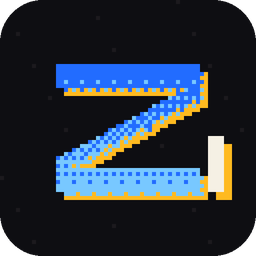

<div align="center">



# Zimacs

A small, fast text editor written in Zig.

</div>

## Install

Linux:

```sh
curl -fsSL https://raw.githubusercontent.com/IWhitebird/Zimacs/master/scripts/install.sh | sh
```

Windows (PowerShell):

```powershell
irm https://raw.githubusercontent.com/IWhitebird/Zimacs/master/scripts/install.ps1 | iex
```

Or download it from the
[releases page](https://github.com/IWhitebird/Zimacs/releases/latest).

Zimacs updates itself. Updates are signed, and one that fails the check is
refused. Set `auto_update = false` in the settings to turn this off.

## Settings

`Help → Edit Settings`, or `Ctrl+,`. The file lives in `~/.config/zimacs`
on Linux and `%APPDATA%\zimacs` on Windows.

## Notes

Open a folder of Markdown files with `File → Open Folder`. In a note:

- `[[name]]` links to another note. `Ctrl+click` follows the link, and
  makes the note if it does not exist yet. Typing `[[` lists the notes.
- `View → Backlinks` (`Ctrl+Shift+B`) lists the notes that link to it.
- `View → Graph` (`Ctrl+Shift+G`) shows the notes and their links as a
  graph. Click a dot to open its note.

Markdown links to notes, `[text](note.md)`, count as links too.

## AI agents (beta)

This is a beta: the tools and their names may change.

`zimacs mcp [folder]` runs an [MCP](https://modelcontextprotocol.io)
server over standard input and output. Its tools list, read, write,
search and follow the notes in the folder, so an agent can keep its memory
there as linked notes. The graph updates as the agent writes.

Without a folder it uses `~/.local/share/zimacs/memory` on Linux and
`%LOCALAPPDATA%\zimacs\memory` on Windows. `File → Open Memory Folder`
opens it with its graph.

For Claude Code:

```sh
claude mcp add --scope user zimacs -- zimacs mcp
```

`Help → Copy MCP Command` copies this with the full path to Zimacs. For
agents set up with a JSON file:

```json
{ "mcpServers": { "zimacs": { "command": "zimacs", "args": ["mcp"] } } }
```

## Build

Needs [Zig 0.16.0](https://ziglang.org/download/).

```sh
zig build run
zig build test
```

## Licence

MIT. Bundles JetBrains Mono and a subset of Noto Emoji, both under the
SIL Open Font License 1.1. The website shows the Zig logo, under CC BY-SA 4.0.
